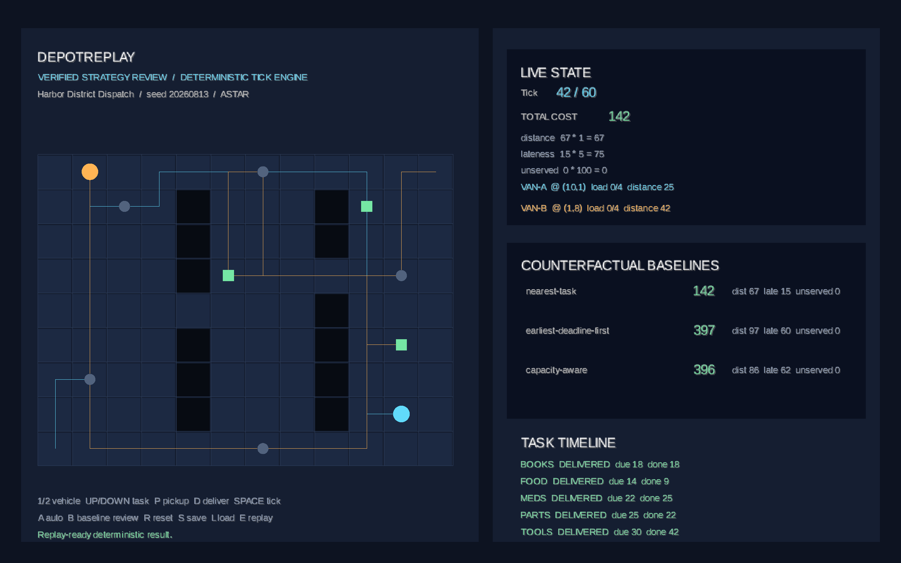

# DepotReplay

**A deterministic dispatch strategy game with counterfactual evaluation.**

**[Play the latest deployed DepotReplay build](https://b2ty9t7yhz-source.github.io/depotreplay/)**

DepotReplay is a Java 21/libGDX desktop and browser game with a headless simulation laboratory. A player dispatches two vehicles across a four-neighbor grid, picking up and delivering capacity-constrained tasks before their deadlines. The same scenario can be rerun with three transparent baselines or a bounded exact solver, so comparisons use identical rules rather than separate implementations.



## 60–90 second reviewer demo

1. Open the [browser game](https://b2ty9t7yhz-source.github.io/depotreplay/) and click the board.
2. Press `A` several times to let nearest-task make visible dispatch decisions. Press `B` to load each reference strategy, then `Space` to inspect its route one tick at a time.
3. Press `R`, make or auto-step a player run, then press `E`. The browser downloads a self-contained replay only after regenerating and verifying every tick hash.
4. Choose that replay below the game, press `L`, and then press `Space`. The same renderer now shows `VERIFIED REPLAY REVIEW` from tick 0. Editing a scenario, command, or tick hash causes the import to be rejected instead.

The browser demo is static: replay files are processed locally and are not uploaded to a server.

This workflow is verified against the current source checkout. The public link reflects the most recent GitHub Pages deployment and may lag local or unmerged changes; use the source Quick Start if the replay controls are not present there yet.

## Quick start from source

```bash
./gradlew clean check --no-configuration-cache --no-daemon
./gradlew :web:webDist --no-configuration-cache --no-daemon
python3 -m http.server 8000 --directory web/build/site
```

Open `http://localhost:8000`. The first command is the complete Java quality gate; the next two build and serve the same static browser artifact used by GitHub Pages.

## Why this project exists

Dispatch games are easy to make visually plausible and hard to make reproducible. DepotReplay treats reproducibility as part of the game contract:

- fixed logical ticks instead of wall-clock time;
- explicit 64-bit scenario seeds and a reproducible seeded generator;
- a command log as the only player input history;
- canonical JSON serialization and SHA-256 state hashes;
- per-tick replay verification, including corrupted replay detection;
- deterministic multi-seed benchmarks with regenerating report verification;
- one headless core shared by player, baseline, exact-solver, save/load, and replay flows.

The project does **not** claim real-world vehicle-routing performance. It is a deterministic strategy game and evaluation environment over synthetic grid scenarios.

## Requirements

- JDK 21 to build from source
- macOS, Linux, or Windows with a desktop OpenGL environment for the native game
- a modern WebGL-capable browser for the static web build

No system Gradle installation is required; the repository includes the Gradle Wrapper. Native installers bundle a reduced Java 21 runtime, so players do not need to install Java.

## Build and test

From the repository root:

```bash
./gradlew clean check --no-configuration-cache --no-daemon
```

This compiles all modules with Java 21 and `-Xlint:all -Werror`, builds the browser site, runs the headless JUnit 5 suite, and generates the JaCoCo report at `core/build/reports/jacoco/test/html/index.html`.

Direct and transitive dependency versions are locked per module. Gradle verifies downloaded artifacts against checked-in SHA-256 metadata in strict mode, and the Wrapper distribution has its own pinned SHA-256 checksum.

Run the real Chromium replay workflow after building the site:

```bash
cd web
npm ci
npx playwright install chromium
npm run test:e2e
```

This downloads a replay from the TeaVM game, imports and verifies it, advances the rendered review by one tick, rejects a changed tick hash, and checks the browser import-size boundary.

## Play in a browser

Public demo: [https://b2ty9t7yhz-source.github.io/depotreplay/](https://b2ty9t7yhz-source.github.io/depotreplay/)

Build and serve the static site:

```bash
./gradlew :web:webDist --no-configuration-cache --no-daemon
python3 -m http.server 8000 --directory web/build/site
```

Open `http://localhost:8000`, click the game once, and use the same dispatch controls listed below. The generated site has no server-side runtime and can be hosted on GitHub Pages or any static website host. In the browser, `S` stores a verified replay in local storage, `L` verifies and loads a selected or stored replay from tick 0, and `E` downloads a portable replay file. Desktop `S`/`L` remains a resumable file-backed checkpoint.

The manual `Deploy browser game to GitHub Pages` workflow publishes `web/build/site/` after GitHub Pages is configured to use GitHub Actions.

## Play the desktop game

```bash
./gradlew :desktop:run --no-configuration-cache --no-daemon
```

Controls:

| Key | Action |
| --- | --- |
| `1` / `2` | Select a vehicle |
| `Up` / `Down` | Select a task |
| `P` / `D` | Queue pickup or delivery for the current tick |
| `Space` | Advance exactly one logical tick |
| `A` | Auto-dispatch idle vehicles with nearest-task, then advance one tick |
| `B` | Cycle through deterministic baseline reviews; use `Space` to step through the selected run |
| `R` | Reset the scenario |
| `S` / `L` | Save or load a hash-verified checkpoint |
| `E` | Export and verify a replay under `build/` |
| `Esc` | Exit |

Run a different scenario:

```bash
./gradlew :desktop:run --args='--scenario examples/exact-mini.json' --no-configuration-cache --no-daemon
```

Regenerate the checked-in screenshot from a real rendered frame:

```bash
./gradlew :desktop:run --args='--scenario examples/city-grid.json --screenshot docs/images/depotreplay-gameplay.png' --no-configuration-cache --no-daemon
```

## Build native installers

Build the installer for the current operating system:

```bash
./gradlew :desktop:jpackageInstaller --no-configuration-cache --no-daemon
```

The output is a PKG on macOS, MSI on Windows, or DEB on Linux under `desktop/build/jpackage/installer/`, accompanied by `SHA256SUMS`. Each installer includes the Java runtime and built-in example scenario. `jpackage` does not cross-compile; the `Distributions` GitHub Actions workflow builds all three platforms on native runners.

The project does not include signing identities, so generated installers are unsigned and may trigger an unknown-publisher warning. See [Distribution](docs/distribution.md) for platform requirements, hosting, and signing boundaries.

## Headless examples

Validate an input and print its canonical scenario hash:

```bash
./gradlew :core:run --args='validate examples/city-grid.json' --no-configuration-cache --no-daemon
```

Run a baseline, persist a replay, and verify every state hash:

```bash
./gradlew :core:run --args='run examples/city-grid.json nearest-task build/city.replay.json' --no-configuration-cache --no-daemon
./gradlew :core:run --args='verify build/city.replay.json' --no-configuration-cache --no-daemon
```

Compare score components, vehicle routes, pickup ticks, and delivery ticks:

```bash
./gradlew :core:run --args='compare examples/city-grid.json build/city.replay.json' --no-configuration-cache --no-daemon
```

Solve the deliberately small exact example and write a verified replay:

```bash
./gradlew :core:run --args='exact examples/exact-mini.json build/exact-mini.replay.json' --no-configuration-cache --no-daemon
```

Generate the same canonical scenario whenever the seed is the same:

```bash
./gradlew :core:run --args='generate 12345 build/seeded-12345.json' --no-configuration-cache --no-daemon
```

Compare every baseline over 25 reproducibly generated scenarios, then independently regenerate and verify the complete report:

```bash
./gradlew :core:run --args='benchmark 0 25 build/benchmark-seeds-0-24.json' --no-configuration-cache --no-daemon
./gradlew :core:run --args='verify-benchmark build/benchmark-seeds-0-24.json' --no-configuration-cache --no-daemon
```

All CLI commands return a nonzero status for invalid input or I/O errors. Replay corruption has a distinct exit status and a `CORRUPTED:` diagnostic.

## Game rules

- The map is a rectangular 2D grid with blocked cells and unit-cost, four-neighbor movement.
- Exactly two vehicles start at fixed traversable cells. Each has an integer capacity.
- A task has a pickup, delivery, demand, and inclusive completion deadline.
- A vehicle may carry multiple tasks while total demand remains within capacity.
- One route cell is traversed per tick. Service at the current cell consumes one tick.
- A run ends when every task is delivered or `maxTicks` is reached.

Invalid IDs, dimensions, duplicate obstacles, blocked endpoints, disconnected required cells, impossible demands, bad deadlines, unsupported schemas, and malformed commands are rejected with actionable messages.

## Routing and dispatch strategies

Both Dijkstra and A* use the same deterministic neighbor and tie ordering. Because every edge costs one, both return a shortest path; A* uses Manhattan distance as its heuristic.

The baselines are intentionally understandable:

- **nearest-task** chooses the closest actionable pickup or onboard delivery;
- **earliest-deadline-first** prioritizes the smallest deadline, then distance;
- **capacity-aware** prefers high-demand pickups that fit, but delivers onboard work when its remaining deadline slack cannot absorb the nearest pickup detour.

They are comparison baselines, not claims of optimality.

### Deterministic benchmark boundary

The `benchmark` command runs all three baselines over consecutive seeds from the versioned `seeded-grid-v1` generator. Its canonical JSON records the simulation contract version, each scenario hash, full score breakdown, strategy final-state hash, integer aggregate totals, and best-score counts. Ties count as best for every tied strategy. `verify-benchmark` regenerates the entire suite and rejects any semantic difference.

A report contains between **1 and 1,000 scenarios**, and seed ranges may not overflow a signed 64-bit integer. This is a safety limit for repeatable local and CI evaluation, not a throughput claim.

### Exact solver boundary

`exact-small` exhaustively searches feasible pickup/delivery event orders and vehicle assignments, then replays its winning command sequence through the normal engine. It accepts **at most 5 tasks, exactly 2 vehicles, 400 grid cells, and 200 ticks**. Inputs outside any limit fail fast. This explicit cap keeps the exponential search honest and prevents the CLI from implying production-scale optimization.

## Score

Lower cost is better:

```text
total = distanceWeight * totalVehicleMoves
      + latenessWeight * sum(max(0, deliveryTick - deadline))
      + unservedWeight * count(tasks not delivered)
```

The UI and CLI expose raw distance, lateness, and unserved counts plus every weighted component. No hidden bonus or random tie-break affects the score.

## Determinism, save/load, and replay verification

A canonical state contains the scenario identity, seed, tick, grid, sorted vehicle/task state, route traces, score, and applied command log. Canonical JSON uses stable property ordering, stable collection ordering, UTF-8, and no insignificant whitespace before SHA-256 hashing.

A replay is self-contained and records:

1. the scenario and its hash;
2. the ordered command log;
3. the canonical state hash for tick 0 and every subsequent tick;
4. the expected final state hash.

Verification reconstructs the simulation rather than trusting stored state. It stops at the first scenario, command, tick, or hash mismatch. Save files use the same principle: scenario plus applied command history are replayed to `savedAtTick`, and the reconstructed state must match the stored hash before the engine is returned.

See [Replay and save format](docs/replay-and-save.md) for the precise contracts.

## Technical challenges and design tradeoffs

- **Cross-runtime canonical hashes.** Desktop and CLI persistence use Jackson, while the reflection-disabled TeaVM build cannot depend on reflective object mapping. A reflection-free JSON encoder and SHA-256 implementation produce byte-for-byte identical scenario, snapshot, and replay artifacts; compatibility tests compare both implementations directly.
- **Verification before visualization.** Browser import strictly parses the versioned envelope, regenerates the scenario hash, replays commands through the headless engine, and checks every state hash before the UI receives a review engine. Playback uses queued verified commands and the existing renderer rather than trusting stored positions.
- **One rules engine, several adapters.** libGDX receives immutable snapshots and emits commands. File I/O, browser storage/downloads, native packaging, CLI reports, strategies, and tests stay outside simulation rules.

The main tradeoff is deliberate scope: browser `L` replays from tick 0 instead of restoring an in-progress checkpoint, which makes the verification story inspectable but does not provide arbitrary seeking. Browser imports are capped at 5 MB before parsing. SHA-256 detects changed artifacts but does not authenticate their author.

## Limits and non-goals

- exactly two vehicles, unit-cost four-neighbor movement, and tasks available at tick 0;
- no traffic, collisions, road networks, cloud services, multiplayer, or production dispatch integration;
- no claim that the three transparent baselines are optimal or competitive with research-grade VRP solvers;
- exact search is intentionally limited to 5 tasks, 2 vehicles, 400 grid cells, and 200 ticks;
- browser replay review supports pause-by-default and single-tick stepping, but not seeking or synchronized ghost-route overlays;
- native installers are host-specific and unsigned unless maintainers supply platform signing identities.

## Architecture

```text
desktop (LWJGL3 + files + jpackage) ----\
                                        > game (shared libGDX UI) --> core
web (TeaVM + static HTML/JavaScript) ---/                         engine/I/O
                                                                       |
                                                                       v
                                                 headless tests + CLI + JSON
```

The `core` module has no libGDX dependency and never reads wall-clock time, input devices, or rendering state. The shared `game` module translates keys into `DispatchCommand` values and renders immutable snapshots. Desktop and browser modules supply platform launchers and capabilities.

More detail:

- [Architecture](docs/architecture.md)
- [Scenario format](docs/scenario-format.md)
- [Test strategy](docs/test-strategy.md)
- [Distribution](docs/distribution.md)
- [Competitive analysis and prioritized gaps](docs/competitive-analysis.md)
- [ADR 0001: headless deterministic core](docs/adr/0001-headless-deterministic-core.md)
- [ADR 0002: command-derived persistence](docs/adr/0002-command-derived-persistence.md)
- [ADR 0003: bounded exhaustive solver](docs/adr/0003-bounded-exact-solver.md)
- [ADR 0004: platform adapters and distribution](docs/adr/0004-platform-adapters-and-distribution.md)
- [ADR 0005: regenerating deterministic benchmark reports](docs/adr/0005-regenerating-benchmark-reports.md)
- [ADR 0006: portable browser replay verification](docs/adr/0006-portable-browser-replay-verification.md)

## Repository layout

```text
core/       Java simulation, CLI, persistence, strategies, and headless tests
game/       shared libGDX rendering and keyboard input
desktop/    LWJGL3 launcher, file persistence, screenshot capture, and jpackage
web/        TeaVM launcher, browser replay adapter, static shell, and Chromium smoke test
examples/   validated synthetic scenarios
docs/       architecture, ADRs, formats, test strategy, and screenshot
.github/    CI, cross-platform distribution, and GitHub Pages workflows
```

## Continuous integration

The GitHub Actions workflow is configured with Temurin Java 21, Node.js 24, the checked-in Gradle Wrapper, and pinned Playwright test dependencies. It runs a clean `check`, executes the verified replay workflow in headless Chromium, regenerates and verifies the deterministic benchmark report, and uploads diagnostic artifacts. The manual/tag distribution workflow builds PKG, MSI, DEB, and static web artifacts on native runners. The separate Pages workflow deploys only when manually requested.

## License

DepotReplay is available under the [MIT License](LICENSE).
