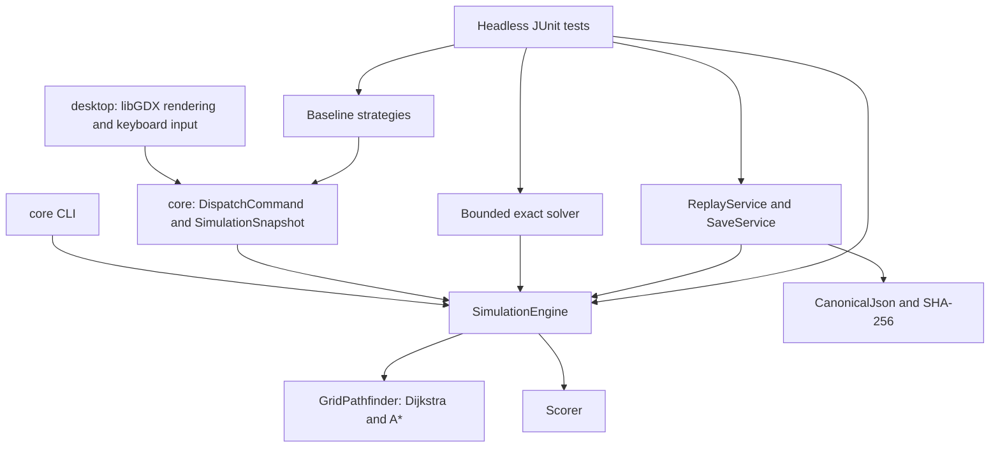
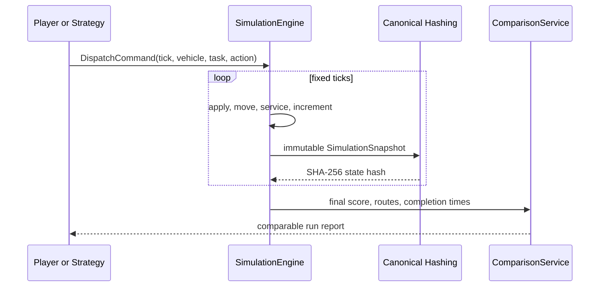

# Architecture

## Goals

DepotReplay separates deterministic rules from presentation so every player run, baseline, exact plan, save, and replay is evaluated by one implementation. The architecture favors inspectable data and replaceable adapters over a large game framework inside the domain layer.

## Dependency direction

`desktop` depends on `core`. `core` does not depend on libGDX, OpenGL, a windowing toolkit, wall-clock time, threads, or input devices.

## Core components

### Model

Records under `core.model` define scenario input, commands, immutable snapshots, and score components. Runtime mutation is private to `SimulationEngine`; callers receive copies of lists and cannot mutate live state.

### Validation

`ScenarioValidator` accumulates structural errors before construction of an engine. After local checks pass, it verifies that both vehicle starts and every task endpoint belong to one connected traversable component. This prevents a strategy from failing later because an apparently valid target is unreachable.

### Routing

`GridPathfinder` implements unit-cost Dijkstra and A*. Both use an ordered priority queue and ordered neighbors, so equal-length alternatives resolve identically on every run. A path excludes its start and includes its goal, which makes its length equal to movement ticks.

### Fixed-tick engine

At tick `t` the engine:

1. applies commands scheduled for `t` in stable vehicle/task/action order;
2. advances each vehicle by at most one grid cell in stable vehicle ID order;
3. completes a pickup or delivery that has reached its target at logical time `t + 1`;
4. increments the global tick once;
5. exposes a new immutable snapshot.

Service at the current cell still consumes one tick. The exact solver mirrors this with `max(1, pathDistance)` for an event.

### Strategies

Strategies inspect only `SimulationSnapshot`, `VehicleSnapshot`, and `GridPathfinder`. `StrategyRunner` converts a decision into a normal `DispatchCommand`. No strategy can mutate vehicle position, task state, score, or time directly.

### Exact solver

The exact solver searches pickup/delivery event orders and vehicle assignments using the same shortest-path distances, capacities, deadlines, service timing, and score weights as the engine. A memoized state includes both vehicles' positions, logical availability times, loads, cargo masks, and global pickup/delivery masks. The selected plan must replay through `SimulationEngine` to the same score before it is returned.

### Persistence

`CanonicalJson` creates stable UTF-8 JSON bytes and SHA-256 hashes. `ReplayService` stores a hash for every tick and checks them during reconstruction. `SaveService` stores enough command history to reconstruct an in-progress engine and rejects a checkpoint whose reconstructed hash differs.

## Data flow for a comparison

## Error boundaries

- Invalid scenarios fail before simulation state is created.
- Invalid player commands raise `CommandRejectedException` without partial command application.
- Missing paths raise `PathNotFoundException`; scenario connectivity validation normally prevents this during a valid run.
- File and JSON failures are wrapped with their target path.
- Replay/save mismatches raise `CorruptedReplayException` and never return unverified state.

## Current boundaries

- Two vehicles are required by the game contract.
- Grid edges are four-neighbor and unit cost; there is no traffic or collision model.
- Tasks are available at tick 0; release times are not modeled.
- The exact solver has a hard exponential-scale gate documented in the README and ADR 0003.
- Baselines are deterministic reference policies, not production route optimizers.
